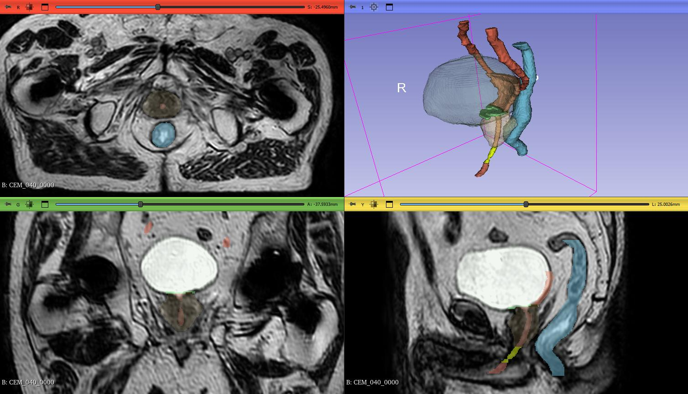

# urinary-OARs-segmentation-nnUNet

## Overview
This repository hosts the code, trained models, and scripts for a deep learning method based on nnU-Net, designed for automatic segmentation of urinary organs at risk (OARs) and pelvic structures on multicentric prostate MRI. The method targets key structures such as the intraprostatic urethra, bladder trigone, bladder neck, bulbous urethra, ureters, bladder, rectum, and prostate for prostate cancer radiotherapy planning.

The model is trained and validated on datasets from multiple centers including MR-linac devices (Unity®, Elekta and MRIdian®, Viewray) and the public [PROSTATEx](https://www.cancerimagingarchive.net/collection/prostatex/) database (Siemens MAGNETOM Trio and Skyra MR scanners). Evaluation metrics include Dice Similarity Coefficient (DSC), Hausdorff Distance (HD95), and Surface Distance (SD).

This repository accompanies an ongoing, under-review study on automatic segmentation of urinary organs at risk for prostate cancer radiotherapy and does not yet correspond to a final, published article.

## Built on nnU-Net
This project builds upon the powerful and self-configuring [nnU-Net](https://github.com/MIC-DKFZ/nnUNet) framework for medical image segmentation. We implemented a customized 3D full-resolution nnU-Net configuration optimized for segmenting small urinary structures while maintaining anatomical context for larger pelvic organs.

## Data and Labels

- Multicentric MRI datasets:
  - MR-linac images from Unity® and MRIdian®
  - [PROSTATEx](https://www.cancerimagingarchive.net/collection/prostatex/)x public dataset from Siemens
- Imaging modality: T2-weighted MRI
- Label set:
  - 0: background
  - 0: bladder
  - 0: prostate
  - 0: intraprostaticurethra
  - 0: rectum
  - 0: ureters
  - 0: bladderneck
  - 0: bladdertrigone
  - 0: bulbousurethra
  - 0: membranousurethra
  - 0: "internecktrigone



## Repository Structure

```

/nnunet/
/plans/                  \# Custom nnU-Net plans JSON files
/trainers/               \# Custom nnU-Net trainer scripts
/scripts/
/prepare_data/           \# Scripts for data conversion and dataset organization
/training/               \# Scripts to run planning, preprocessing, and training
/inference/              \# Scripts for inference and RTStruct conversion
/models/
README_download_models.md \# Instructions and links to pre-trained weights
/docs/
metrics_description.md   \# Description of evaluation metrics
example_cases.md         \# Visual examples of segmentations

```

## Installation and Requirements

- Python 3.9+
- PyTorch with CUDA support
- nnU-Net version 2 (Please follow the official nnU-Net repository for detailed and up-to-date installation instructions: https://github.com/MIC-DKFZ/nnUNet)
- SimpleITK, nibabel, medpy, pydicom, rt-utils
  
## Data Preparation

- Follow nnU-Net dataset folder conventions:

```

Dataset072_Prostate/
imagesTr/
labelsTr/
imagesTs/ (optional)
dataset.json

```

- Convert DICOM to NIfTI:

```

python scripts/prepare_data/convert_dicom_to_nifti.py --input /path/to/dicom/ --output /path/to/nii/

```

- Harmonize multi-center data via resampling, N4 bias correction, histogram matching, etc. (see scripts)

## Training

- Plan and preprocess data:

```

nnUNetv2_plan_and_preprocess -d 072 -c 3d_fullres --verify_dataset_integrity

```

- Train 5-fold cross-validation models (example for fold 0):

```

CUDA_VISIBLE_DEVICES=0 nnUNetv2_train 072 3d_fullres 0 -tr nnUNetTrainer_UrinaryOARs

```

- Repeat for folds 1 to 4 on available GPUs.

- Training parameters:
  - Patch size and batch size optimized for small structure segmentation
  - Loss: combination of Dice and Cross-Entropy (optionally boundary loss)
  - Extensive data augmentation applied

## Inference

- Run inference on test data:

```

nnUNetv2_predict -i /path/to/imagesTs/ -o /path/to/output/ -d XXX -c 3d_fullres -tr nnUNetTrainer_UrinaryOARs

```

- Optional: Convert predicted NIfTI masks to DICOM RTStruct for radiotherapy systems:

```

python scripts/inference/convert_prediction_to_rtstruct.py --input /path/to/output --dicom_series /path/to/reference_dicom --output /path/to/rtstruct/

```

## Evaluation

- Metrics included:
  - Dice Similarity Coefficient (DSC)
  - 95th percentile Hausdorff Distance (HD95) measured with MedPy
  - Mean Surface Distance (SD)

## Pre-trained Models

- Pre-trained model weights are available in this repository under the /models directory.
- Place weights in:

```

\$NNUNET_RESULTS/nnUNet/3d_fullres/DatasetXXX_UrinaryOARs/nnUNetTrainer_UrinaryOARs/

```

## How to Reproduce

1. Prepare and convert datasets
2. Run planning and preprocessing
3. Train model folds
4. Run inference with ensemble
5. Evaluate quantitative metrics

Full pipeline scripts provided under `/scripts/`

## How to cite

This work is currently under review; citation details will be updated after publication.

Please also cite the original nnU-Net paper:

```

@article{Isensee2021nnuNet,
title={nnU-Net: Self-adapting Framework for U-Net-based Medical Image Segmentation},
author={Isensee et al.},
journal={Nature Methods},
year={2021}
}

```

## Limitations and Use

- Intended for research use on multicentric prostate MRI for radiotherapy planning.
- Validated on specific MRI systems and acquisition protocols.
- Manual expert review mandatory before clinical application.
- Performance outside the training data domain (different MRI systems, protocols, pathologies) is not guaranteed.

## License

This project is licensed under the MIT License. It incorporates code from nnU-Net, which is licensed under Apache 2.0. Both licenses apply and must be respected. See LICENSE file for details.

## Contributing

Contributions, bug reports, and feature requests are welcome. Please open an issue or pull request.

Contact: miguel.castro@univ-rennes.fr
```
